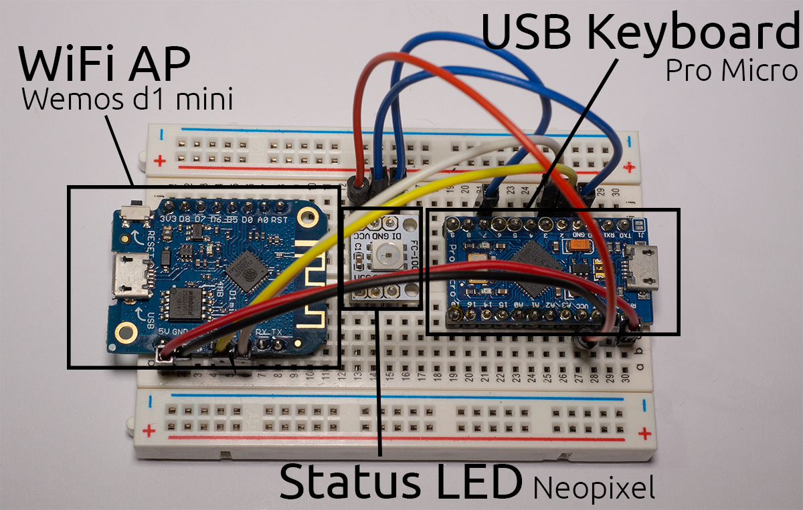
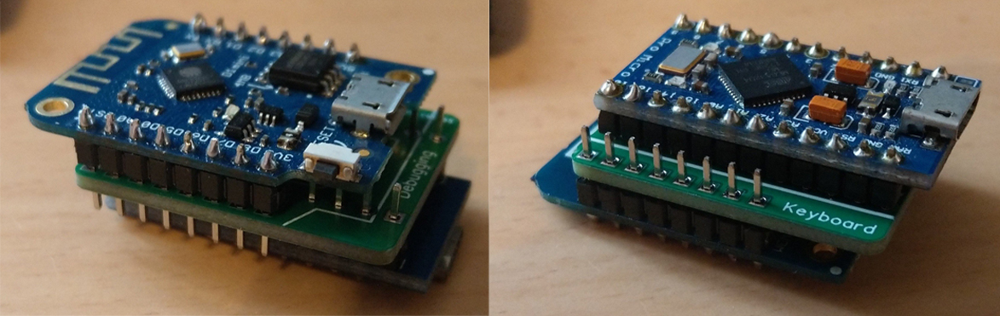
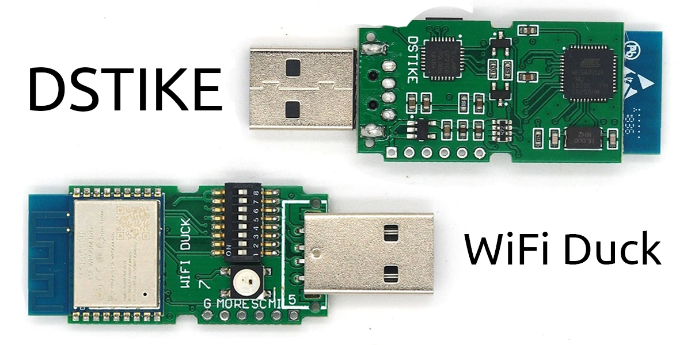
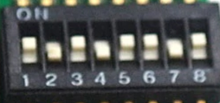
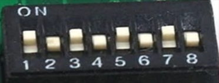
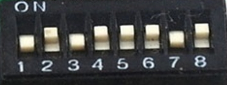

# WiFiDuck

<p align="center">

</p>

<p align="center">
<b>Keystroke injection attack platform</b>
<br>
A worthy successor of the <a href="https://github.com/spacehuhn/wifi_ducky/">WiFi Ducky</a> project
<br>
<br>
  🐦 <a href="https://twitter.com/spacehuhn">Twitter</a>
| 📺 <a href="https://www.youtube.com/spacehuhn">YouTube</a>
| 🌍 <a href="https://spacehuhn.io">spacehuhn.io</a>
<br>
<br>
<br>

<br>
<br>
<br>
<a href="https://www.youtube.com/watch?v=sSJuGXd8QRk">

<br>
<b>Watch the full video</a></b>
</p>

## Overview

- [Disclaimer](#disclaimer)
- [About](#about)
- [Changes](#changes)
- [Hardware](#hardware)
  - [Supported Boards](#supported-boards)
  - [Connections](#connections)
  - [PCB](#pcb)
  - [DSTIKE WiFi Duck](#dstike-wifi-duck)
- [Flash Software](#flash-software)
  - [Preparations](#preparations)
  - [Flash Atmega32u4](#flash-atmega32u4)
  - [Flash ESP8266](#flash-esp8266)
  - [Unbrick Atmega32u4](#unbrick-atmega32u4)
- [Usage](#usage)
  - [Ducky Script](#ducky-script)
  - [CLI](#cli)
  - [Debug](#debug)
  - [FAQ](#faq)
- [Development](#development)
  - [Edit Web Files](#edit-web-files)
  - [Translate Keyboard Layout](#translate-keyboard-layout)
- [License](#license)
- [Credits](#credits)

## Disclaimer

**This is a tool.**  
**It's neither good nor bad.**  
**Use it to do good, to study, and to test.**  
**Never use it to do harm or create damage!**  

**The continuation of this project counts on you!**  

## About

By emulating a USB keyboard, this device can be used to remote control a computer,
automate tasks or execute software to gain full access. All in the matter of seconds!  

This is all possible because keyboards are trusted devices,
you plug it in and can start typing right away!  
A human might not type very fast,
but an automated device like this presses of hundreds of keys per second.  

This open source project aims to provide a user-friendly tool to learn about such
keystroke injection attacks.  

By using the [Ducky Script](#ducky-script) language that [Hak5](https://www.hak5.org/)
introduced with the [USB Rubber Ducky](https://hakshop.com/products/usb-rubber-ducky-deluxe),
it's easy to get started right away!  

You can simply plug it in, connect to its Wi-Fi network and manage all scripts
from within the web interface.
You don't need to install an app; you don't need to log in, and you don't need to compile or flash anything.
Your scripts are saved on the device itself, so you don't need a micro SD card either.  

## Changes

Changes since the [WiFi Ducky](https://github.com/spacehuhn/wifi_ducky/) predecessor:
* Support for multiple keyboard layouts
* No size limit per script (other than the physical memory limit)
* No line length limit for the `STRING` command
* Faster typing speed
* Optional Neopixel or Dotstar LED
* Entirely new web interface
* Support for I2C to enable easier debugging and DIY builds

## Hardware

[Video Tutorial](https://youtu.be/-Gmv98tUiYw)  

This tool requires following hardware:  
* An Atmega32u4 based board (for example: Arduino Leonardo or Pro Micro)  
* An ESP8266 or ESP8285 (for example NodeMCU or Wemos d1 mini)  
* [Optional] A single Neopixel (WS2812b) or Dotstar (APA102) LED

You will also need a computer and USB data cable to flash the microcontrollers.  

If you're a beginner,
it's recommended you wire everything together on a breadboard first!  
So get a breadboard with a couple of jumper wires.  

If you wish to solder everything together to a small DIY gadget,
you'll obviously need soldering equipment and a bit of experience using it.  

### Supported boards

#### Preflashed All-In-One Boards
* [DSTIKE WiFi Duck](#dstike-wifi-duck)

You can use any Atmega32u4 or ESP8266 based development board,
but if you have no idea where to start, here's a list.  
**Just remember, you will need both microcontrollers!**  
The Atmega32u4 is the USB keyboard, the ESP8266 is the WiFi access point.

#### Atmega32u4 Development Boards
* Arduino Leonardo
* Arduino Micro
* Sparkfun Pro Micro
* CJMCU Beetle
* SS Micro

**DIGISPARK or other ATTINY85 based development boards, are NOT supported!**  

#### ESP8266 Development Boards
* NodeMCU 1.0 (ESP-12E Module)
* LOLIN(WEMOS) D1 Mini
* LOLIN(WEMOS) D1 Mini Pro
* LOLIN(WEMOS) D1 Mini Lite

### Connections

Here's a map of the pins that need to be connected.  

| ESP8266 | Atmega32u4 |
| ------- | ---------- |
| `D1` alias `GPIO 5` | `3` alias `SCL` |
| `D2` alias `GPIO 4` | `2` alias `SDA` |
| `GND` | `GND` |

Both chips have to be powered in order to work.  
To share power between both, you need a voltage regulator that takes 5V and turns it into 3.3V.  
It's because USB runs at 5V but the ESP8266 runs at 3.3V. Luckily most development boards have such a regulator on board.  
**DO NOT CONNECT ESP8266 VCC to the ATMEGA32u4 VCC**, it will kill the ESP826. Instead look for the `5V` or `VIN` pin on your dev board, as those will be connected to the regulator.  

| ESP8266 Dev Board |      Atmega32u4      |
| ----------------- | -------------------- |
| `5V` or `VIN`     | `RAW`, `5V` or `VIN` |

If you like to add a Neopixel (WS2812b) LED:  

| Atmega32u4 | Neopixel LED |
| ---------- | ------------ |
| `7`* | `DI` alias `Data`, `In` |
| `5V` alias `VCC` | `5V` alias `VCC` |
| `GND` | `GND` |

\* The Data pin can be changed later on in the software, pin 7 is just an example.  



### PCB

To make the DIY process easier, I designed a small PCB.  

Design Files:  
* Pro Micro + Wemos d1 mini: https://easyeda.com/Spacehuhn/wifi-duck
* Pro Micro + NodeMCU: https://easyeda.com/Spacehuhn/diy-wifi-duck-pro-micro-nodemcu

You can also order them on OSHPark:
* Pro Micro + Wemos d1 mini: https://oshpark.com/shared_projects/ARCED9je
* Pro Micro + NodeMCU: https://oshpark.com/shared_projects/XUuUH1HB

You'll have to solder a Pro Micro board on one side and a Wemos d1 mini
or NodeMCU board (depending on the PCB) on the other side.  
That's it.  
You don't even have to solder all pins,
just the ones mentioned in [Connections](#connections), excluding the LED.




### DSTIKE WiFi Duck

If you like to support this project,
Travis Lin sells a custom designed development board which comes preflashed with this software!  

  

You can purchase one here:  
- [tindie](https://www.tindie.com/products/lspoplove/dstike-wifi-duck/)
- [DSTIKE](https://dstike.com/products/dstike-wifi-duck)
- [AliExpress](https://www.aliexpress.com/item/4000256143274.html)

You can update the ESP8266 over the air and flash the Atmega32u4 via Arduino,
all while enclosed in its neat little case.  

[Update Tutorial Video](https://youtu.be/e3-nsOjclsY)

If you wish to develop your own software or help improve this one,
the 8-bit DIP-switch makes it easy for you to access the Atmega32u4 or ESP8266 independently.  

To flash it see [Flash Software](#flash-software).
Or select `Arduino Leonardo` for the Atmega32u4
and `NodeMCU 1.0 (ESP-12E Module)` for the ESP8266.  

| Mode | Atmega32u4 | ESP8266 | DIP-switch | Image |
| --- | --- | --- | --- | --- |
| Default Operating Mode | USB | On | 10101101 |  |
| Atmega32u4 Flash Mode | USB | Off |10101010 |  |
| ESP8266 Flash Mode | Off | USB | 01011101 |  |

## Flash Software

[Video Tutorial](https://youtu.be/VQAzxBefLZo)  

### Preparations

1. Download and install the [Arduino IDE](https://www.arduino.cc/en/main/software).
2. Start the Arduino IDE, go to `File` > `Preferences`.
3. At *Additional Board Manager ULRs* enter `https://raw.githubusercontent.com/spacehuhn/hardware/master/wifiduck/package_wifiduck_index.json`. You can add multiple URLs, separating them with commas.
4. Go to `Tools` > `Board` > `Board Manager`, search for `wifi duck` and install `WiFi Duck AVR Boards` and `WiFi Duck ESP8266 Boards`.
5. [Download](https://github.com/spacehuhn/WiFiDuck/archive/master.zip) and extract this repository or [git clone](https://github.com/spacehuhn/WiFiDuck.git) it.

If you can't find the COM port of ESP8266 board, then you're probably missing the right drivers.
Here are links to drivers of the 2 most used UART chips on ESP8266 development boards:
- 💾 [CP2102](https://www.silabs.com/products/development-tools/software/usb-to-uart-bridge-vcp-drivers)
- 💾 [CH340](https://sparks.gogo.co.nz/ch340.html)

### Flash Atmega32u4

1. Open `atmegaduck/atmega_duck.ino` with the Arduino IDE.
2. Under `Tools` > `Board` in the `WiFi Duck AVR` section, select your board;
for example, `Sparkfun Pro Micro`.
3. Connect the Atmega32u4 board via USB and select its port under `Tools` > `Port`.
4. [Optional] Under `Tools` you can enable the LED and set its pin.
You can also change the USB ID to make it appear as a certain type of keyboard.
5. Press Upload.

### Flash ESP8266

1. Open `esp_duck/esp_duck.ino` with the Arduino IDE.
2. Under `Tools` > `Board` in the `WiFi Duck ESP8266` section, select your board.
For example `NodeMCU 1.0 (ESP-12E Module)`.
3. Connect the ESP8266 board via USB and select its port under `Tools` > `Port`.
5. Press Upload.

**Pro Tip:** If the ESP8266 is already running this software
and you just want to update it, you don't have to connect it via USB.
You can update it over the air! Simply connect to the Wi-Fi network its hosting
(default SSID and password is `wifiduck`).  
In Arduino under `Tools` > `Port` you should now see a network port.
Select it and press `Upload`.  

**Note:** It can take a minute until the device is ready.
After the initial flashing, the ESP8266 has to format its memory.  

If you connected the RGB LED:
* Blue LED = Connection working
* Green LED = Device ready

### Unbrick Atmega32u4

If you flashed your Atmega32u4 board with the wrong bootloader,
it will no longer appear in the port selection after you connect it.  
To solve this, you need to:

1. Connect the reset pin `RST` to ground `GND`.
Preferably with a jumper wires, because you need to be able to disconnect it quickly.  
2. Open a sketch, `atmegaduck/atmega_duck.ino` or an empty sketch.  
**Make sure to have the correct board selected under `Tools` > `Board`!**
3. Connect the board with the wire still connected.
4. Press `Upload` and as soon as you see `Compiling...` turn to `Uploading...`, disconnect the wire.  

Now it should flash the sketch and the correct bootloader.  

## Usage

1. Plug it in.
2. Connect to the WiFi network `wifiduck` with the password `wifiduck`.
3. Open a browser and visit `192.168.4.1`.
4. Click on `Settings` in the top right corner.
5. Change the SSID and password.
6. Go back to write, save and run your first Ducky Script!

### Ducky Script

#### Basics

Keys are separated by a single space.  
Everything written in a single line gets pressed and released at the same time.    
To write text, use the STRING function.  

| Example | Explanation |
| ------- | ----------- |
| WINDOWS <br> r | Type the Windows key and then the r key |
| WINDOWS r | Press the Windows key and the r key simultaneously |
| STRING WINDOWS r | Write WINDOWS r |

#### Functions

| Command | Example | Description |
| ------- | ------- | ----------- |
| `REM` | `REM Hello World!` |Comment |
| `DEFAULTDELAY` or `DEFAULT_DELAY` | `DEFAULTDELAY 200` | Time in ms between every command |
| `DELAY` | `DELAY 1000` | Delay in ms |
| `STRING` | `STRING Hello World!` | Types the following string |
| `REPEAT` or `REPLAY` | `REPEAT 3` | Repeats the last command n times |
| `LOCALE` | `LOCALE DE` | Sets the keyboard layout. Available: `DE`, `ES`, `GB`, `US`, `DK`, `RU`, `FR` |
| `KEYCODE` | `KEYCODE 0x02 0x04` | Types a specific key code (modifier, key1[, ..., key6]) in decimal or hexadecimal |
| `LED` | `LED 40 20 10` |Changes the color of the LED in decimal RGB values (0-255) |

#### Standard Keys

| Key |
| --- |
| `a` - `z` |
| `A` - `Z` |
| `0` - `9` |
| `F1` - `F12` |

#### Modifier Keys

| Key |
| --- |
| `CTRL` or `CONTROL` |
| `SHIFT` |
| `ALT` |
| `WINDOWS` or `GUI` |

#### Other Keys

| Key |
| --- |
| `ENTER` |
| `MENU` or `APP`|
| `DELETE` |
| `HOME` |
| `INSERT` |
| `PAGEUP` |
| `PAGEDOWN` |
| `UP` or `UPARROW` |
| `DOWN` or `DOWNARROW` |
| `LEFT` or `LEFTARROW` |
| `RIGHT` or `RIGHTARROW` |
| `TAB` |
| `END` |
| `ESC` or `ESCAPE` |
| `SPACE` |
| `PAUSE or BREAK` |
| `CAPSLOCK` |
| `NUMLOCK` |
| `PRINTSCREEN` |
| `SCROLLLOCK` |

#### Examples

```
REM Hello World for Windows PCs
DEFAULTDELAY 200
GUI r
STRING notepad
ENTER
STRING Hello World!
```

### CLI

The command line interface or CLI is accessible using a serial connection to the ESP8266 (115200 baud, Newline ending) or via the web interface at `192.168.4.1/terminal.html`.  

#### General

| Command | Description | Example |
| ------- | ----------- | ------- |
| help | Returns all available commands | `help` |
| ram | Returns available memory in bytes | `ram` |
| version | Returns version number | `version` |
| settings | Returns list of settings | `settings` |
| set -n/ame <value> -v/alue <value> | Sets value of a specific setting | `set ssid "why fight duck"` |
| reset | Resets all settings to their default values | `reset` |
| status | Returns status of i2c connection with Atmega32u4 | `status` |
| run <...> | Starts executing a Ducky script | `run example.txt` |
| stop <...> | Stops executing a Ducky script | `stop example.txt` |

#### SPIFFS File Management

| Command | Description | Example |
| ------- | ----------- | ------- |
| mem | Returns available, used and free memory of SPIFFS in bytes | `mem` |
| format | Formats SPIFFS | `format` |
| ls <...> | Returns list of files | `ls /` |
| create <...> | Creates file | `create example.duck` |
| remove <...> | Deletes file | `remove example.duck` |
| cat <...> | Returns content of file | `cat example.duck` |
| rename -fileA,a <value> -fileB,b <value> | Renames file | `rename example.duck example.txt` |
| write -f/ile <value> -c/ontent <value> | Writes (appends) data to file | `write example.txt "Hello World!"` |
| stream <...> | Opens file stream | `stream example.txt` |
| close | Closes file stream | `close` |
| read | Read and return the result from file stream | `read` |

If a stream is open, everything you type (except messages containing exactly `close` or `read`) will be written to the file until you type `close`!  

### Debug

To properly debug, you need to have both the Atmega32u4
and the ESP8266 connected via USB to your computer.  

That can be tricky when you only have a all in one board, so it might be useful
you built one yourself. You don't need to solder it, for example you can use an
Arduino Leonardo and a NodeMCU and connect them with jumper cables.  

Now open 2 instances of Arduino (so they run as separate processes!),
select the COM port and open the serial monitor for each device.
You might need to reset the Atmega32u4 to see serial output.
If that causes problems with the i2c connection, try to reset the ESP8266 too.  

### FAQ

If you have a question, you can check out the [issue section](https://github.com/spacehuhn/WiFiDuck/issues).  
Use the search function to look up similar questions, be sure to check both open and closed issues!  
Also watch this [video](https://www.youtube.com/watch?v=53zkBvL4ZB4) by LiveOverflow on "How (not) to ask a technical question".  

#### I forgot the password

Flash the ESP8266 again, but make sure that you select `Erase Flash: Sketch + WiFi Settings`
under Tools in the Arduino IDE.  

## Development

### Edit Web Files

If you would like to modify the web interface, you can!  
The `web/` folder contains all `.html`, `.css`, `.js` files.  
You can edit and test them locally as long as you're connected to the WiFi Duck
network thanks to the websocket connection handled by JavaScript in the background.  

To get the new files onto the ESP8266, run `python3 webconverter.py` in the
repository folder.  
It gzips all files inside `web/`, converts them into a hex array
and saves it in `esp_duck/webfiles.h`.  
Now you just need to [flash](#flash-software) the ESP8266 again.  

### Translate Keyboard Layout

Currently the supported keyboard layouts are:  
- [DE](https://github.com/spacehuhn/WiFiDuck/blob/master/atmega_duck/locale_de.h)
- [GB](https://github.com/spacehuhn/WiFiDuck/blob/master/atmega_duck/locale_gb.h)
- [US](https://github.com/spacehuhn/WiFiDuck/blob/master/atmega_duck/locale_us.h)
- [ES](https://github.com/spacehuhn/WiFiDuck/blob/master/atmega_duck/locale_es.h)
- [DK](https://github.com/spacehuhn/WiFiDuck/blob/master/atmega_duck/locale_dk.h)
- [RU](https://github.com/spacehuhn/WiFiDuck/blob/master/atmega_duck/locale_ru.h)
- [FR (ASCII only)](https://github.com/spacehuhn/WiFiDuck/blob/master/atmega_duck/locale_fr.h)

All standard keys are defined in [usb_hid_keys.h](https://github.com/spacehuhn/WiFiDuck/blob/master/atmega_duck/usb_hid_keys.h).  
To translate a keyboard layout, you have to match each character on
your keyboard to the one(s) of a US keyboard.  
This stuff is hard to explain in writing and requires a lot of manual work and testing.  

1. Copy one of the existing layouts files, like [locale_us.h](https://github.com/spacehuhn/WiFiDuck/blob/master/atmega_duck/locale_us.h).  
Preferably one that is close to your keyboard layout, it will save you time!  
2. Add `#include "locale_xx.h"` to the end of the locales.h file.
3. Rename the file and its variables to your language code.
For example:  
`locale_xx.h` -> `locale_de.h`,  
`ascii_xx` -> `ascii_de`,  
`locale_xx` -> `locale_de`,  
`extended_ascii_xx` -> `extended_ascii_de`,  
`utf8_xx` -> `utf8_de`.  
4. Modify the ASCII array.  
The ASCII array has a fixed size. Each row describes a key.
First a modifier key like `KEY_MOD_LSHIFT`, then a character key.
Some ASCII characters can't be typed or don't require a modifier,
that's where you must place `KEY_NONE`.
Check [usb_hid_keys.h](https://github.com/spacehuhn/WiFiDuck/blob/master/atmega_duck/usb_hid_keys.h) for the available keys.  
If multiple modifiers are required, you must use a bitwise OR to connect them: `KEY_MOD_RALT | KEY_MOD_LSHIFT`.  
For example, in [locale_de.h](https://github.com/spacehuhn/WiFiDuck/blob/master/atmega_duck/locale_de.h#L136) `Z` is saved as `KEY_MOD_LSHIFT, KEY_Y`.  
This is because German keyboards use QWERTZ instead of the QWERTY layout
and since the letter is uppercase, shift must be pressed as well.   
Thankfully you don't have to trial and error everything, the Hak5 Community
translated a lot of layouts already [here](https://github.com/hak5darren/USB-Rubber-Ducky/tree/master/Encoder/resources). It's just written in a different syntax. For example, `ASCII_20` (20 in hexadecimal) is the 32th character in our ascii array.  
5. Modify or create the extended ASCII array.  
The extended ASCII array doesn't have a fixed size and is only as long as you make it.
First the character code. For example, [ä](https://theasciicode.com.ar/extended-ascii-code/letter-a-umlaut-diaeresis-a-umlaut-lowercase-ascii-code-132.html) has the index 132, or 84 in hex.
It doesn't use a modifier and sits where the apostrophe key is on a US keyboard:
`0x84, KEY_NONE,       KEY_APOSTROPHE, // ä`.  
6. Modify or create the UTF-8 array.  
The UTF-8 array is variable in length, too.  
The first 4 bytes are the character code.  
For example, [Ä](https://www.fileformat.info/info/unicode/char/00c4/index.htm) has the hex code c384 or 0xc3 0x84. The other 2 bytes are not used so we set them to 0.
Because the letter is uppercase, we need to press the shift key and like before, the letter is typed by pressing the same key as the apostrophe key of a US keyboard: `0xc3, 0x84, 0x00, 0x00, KEY_MOD_LSHIFT, KEY_APOSTROPHE, // Ä`.  
7. Edit the hid_locale_t structure.  
If you renamed all variables accordingly, there's nothing left to do.  
8. Go to [duckparser.cpp](https://github.com/spacehuhn/WiFiDuck/blob/master/atmega_duck/duckparser.cpp#L163) at `// LOCALE (-> change keyboard layout)` you can see a bunch of else if statements.
You need to copy one for your layout.  

Before adding GB layout:  
```c
if (compare(w->str, w->len, "US", CASE_SENSETIVE)) {
    keyboard::setLocale(&locale_us);
} else if (compare(w->str, w->len, "DE", CASE_SENSETIVE)) {
    keyboard::setLocale(&locale_de);
}
```

After adding GB layout:
```c
if (compare(w->str, w->len, "US", CASE_SENSETIVE)) {
    keyboard::setLocale(&locale_us);
} else if (compare(w->str, w->len, "DE", CASE_SENSETIVE)) {
    keyboard::setLocale(&locale_de);
} else if (compare(w->str, w->len, "GB", CASE_SENSETIVE)) {
   keyboard::setLocale(&locale_gb);
}
```
9. Test your layout with a Ducky Script that contains all characters of your keyboard. For example:  
```
LOCALE DE
STRING !"#$%&'()*+,-./0123456789:;<=>?@ABCDEFGHIJKLMNOPQRSTUVWXYZ[\]^_abcdefghijklmnopqrstuvwxyz{|}~²³äöüÄÖÜ߀°§`
ENTER
```
10. Add a link to your layout to [README](README.md), to [web/index.html](web/index.html) and please feel free to improve this tutorial to help future translators!
11. [Create a Pull Request](https://help.github.com/en/articles/creating-a-pull-request)

## License

This software is licensed under the MIT License.
See the [license file](LICENSE) for details.  

## Credits

Other software used for this project:
  - [Arduino](https://www.arduino.cc)
  - [Neopixel Library](https://github.com/adafruit/Adafruit_NeoPixel)
  - [Dotstar Library](https://github.com/adafruit/Adafruit_DotStar)
  - [AVR, ESP8266 & SAMD Arduino Core](https://github.com/spacehuhn/hardware/tree/master/wifiduck)
  - [ESPAsyncTCP](https://github.com/me-no-dev/ESPAsyncTCP)
  - [ESPAsyncWebServer](https://github.com/me-no-dev/ESPAsyncWebServer)
  - [SimpleCLI](https://github.com/spacehuhn/SimpleCLI)
