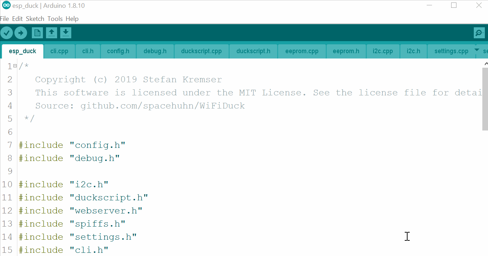

# WiFiDuck

<p align="center">

</p>

<p align="center">
<b>Keystroke injection attack platform</b>
<br>
A worthy successor of the <a href="https://github.com/spacehuhn/wifi_ducky/">WiFi Ducky</a> project
<br>
<br>
  🐦 <a href="https://twitter.com/spacehuhn">Twitter</a>
| 📺 <a href="https://www.youtube.com/spacehuhn">YouTube</a>
| 🌍 <a href="https://spacehuhn.io">spacehuhn.io</a>
<br>
</p>

<p align="center">

</p>

## Overview

- [Disclaimer](#disclaimer)
- [About](#about)
- [Changes](#changes)
- [Hardware](#hardware)
  - [Connections](#connections)
- [Flash Software](#flash-software)
  - [Requirements](#requirements)
  - [Atmega32u4/Atsamd21](#atmega32u4atsamd21)
  - [ESP8266/ESP8285](#esp8266esp8285)
  - [DSTIKE WiFi Duck](#dstike-wifi-duck)
- [Usage](#usage)
  - [CLI](#cli)
  - [Ducky Script](#ducky-script)
  - [Debug](#debug)
  - [FAQ](#faq)
- [Development](#development)
  - [Edit Web Files](#edit-web-files)
  - [Translate Keyboard Layout](#translate-keyboard-layout)
- [License](#license)

## Disclaimer

**This is a tool.**  
**It's neither good nor bad.**  
**Use it to do good, to study and to test.**  
**Never use it to do harm or create damage!**  

**The continuation of this project counts on you!**  

## About

This open source project aims to provide a user-friendly tool to learn about
keystroke injection attacks.  
A microcontroller acts as a USB keyboard that is programmable over WiFi.  
It's using the Ducky Script language that [Hak5](https://www.hak5.org/)
introduced with the [USB Rubber Ducky](https://hakshop.com/products/usb-rubber-ducky-deluxe).  

A keyboard is trusted by most operating systems by default,
which enables for a variety of attacks.  
Humans might not type very fast, but an automated device like this can.  
It can open a terminal and mess with your computer in a matter of a milliseconds!  

## Changes

Changes since the [WiFi Ducky](https://github.com/spacehuhn/wifi_ducky/) predecessor:
* Support for multiple keyboard layouts, adjustable within the script
* No size limit per script (other than the physical limit)
* No line length limit for the `STRING` command
* Faster typing speed
* Added RGB (Neopixel LED)
* Reworked web interface
* Replaced serial with i2c connection, to make debugging and flashing easy

## Hardware

This tool requires following hardware:  
* An Atmega32u4 or Atsamd21 based board (for example: Arduino Leonardo, Arduino Pro Micro or Adafruit Trinked m0)  
* An ESP8266 or ESP8285 (for example NodeMCU or Lolin/Wemos d1 mini)  
* [Optional] A single Neopixel LED (WS2812b)  

You will also need a computer, a working USB cable, patience and common sense.  

If you're a beginner,
it's recommended you wire everything together on a breadboard first!  
So get a breadboard with a couple of jumper wires.  

If you wish to solder everything together to a small DIY gadget,
you'll obviously need soldering equipment and a bit of experience using it.  

### Connections

Here's a map of the pins that need to be connected.  

| ESP8266 | Atmega32u4 |
| ------- | ---------- |
| `GPIO 5` or `D1` | `SCL` or `D3` |
| `GPIO 4` or `D2` | `SDA` or `D2` |
| `GND` | `GND` |

| Atmega32u4 | Neopixel LED |
| ---------- | ------------ |
| `D7` | `DI`, `Data` or `In` |
| `GND` | `GND` |

## Flash Software

### Requirements

Arduino IDE:  
* [Arduino IDE](https://www.arduino.cc/en/main/software)

**Latest** ESP8266 Arduino Core:  
* [ESP8266 Arduino Core](https://github.com/esp8266/Arduino#installing-with-boards-manager)  

Arduino Libraries:  
* [SimpleCLI](https://github.com/spacehuhn/SimpleCLI#installation)
* [ESPAsyncTCP](https://github.com/me-no-dev/ESPAsyncTCP)
* [ESPAsyncWebServer](https://github.com/me-no-dev/ESPAsyncWebServer)

Installing Arduino libraries is always the same procedure:  
Download the repository, unzip it and move it inside the libraries folder.  
If you need more information, here is a
[tutorial](https://www.arduino.cc/en/Guide/Libraries) with more information.  

### Atmega32u4/Atsamd21

1. Open `atmegaduck/atmega_duck.ino` with the Arduino IDE  
2. Under `Tools->Board` select your board, for example `Adafruit Trinket m0`.  
You can also select `Arduino Leonardo` if you use a 5V Atmega32u4 (used on DSTIKE board too)
or `LilyPad Arduino USB` if you use a 3.3V Atmega32u4
3. Plug the board in and select its port under `Tools->Port`  
4. Press the Upload button  

### ESP8266/ESP8285

1. Open `esp_duck/esp_duck.ino` with the Arduino IDE  
2. Under `Tools->Board` select `NodeMCU 1.0 (ESP-12E Module)`
(or whatever corresponds best to your ESP8266/ESP8285 based board).  
**Be sure to use the latest ESP8266 Arduino Core, see [requirements](#requirements)!**  
3. Under `Tools->Flash Size` select `4M (3M SPIFFS)` (or `1M (512K SPIFFS)`
if you use a ESP-07 Module or ESP8285 based board).  
4. Plug the board in and select its port under `Tools->Port`  
5. Press the Upload button  

  

### DSTIKE WiFi Duck

If you like to support this project,
Travis Lin sells a custom made board that ships preflashed!  

  

It features a 8bit DIP-switch, making it easy for you to flash both the ESP8266
and the Atmega32u4:  


| Mode | DIP-switch | Image |
| --- | --- | --- |
| Normal Work Mode (Default Operating Mode) | 10101101 |  |
| Atmega32u4 (Arduino Pro Micro) Flash Mode | 10101010 |  |
| ESP8266 (NodeMCU 1.0) Flash Mode | 01011101 |  |


You can purchase one here:  
- [tindie](https://www.tindie.com/products/lspoplove/dstike-wifi-duck/)
- [DSTIKE](https://dstike.com/products/dstike-wifi-duck)
- [AliExpress](https://www.aliexpress.com/item/4000256143274.html)
- [taobao](https://shop135375846.world.taobao.com/)

## Usage

1. Plug it in (a blue Neopixel LED tells you that the connection is working)  
2. Connect to the WiFi network `wifiduck` with the password `wifiduck`
3. Open a browser and visit `192.168.4.1`
4. Click on Settings in the top right corner
5. Change the SSID and password

### CLI

The command line interface or CLI is accessible using a serial connection to the ESP8266 (115200 baud, Newline ending) or via the web interface at `192.168.4.1/terminal.html`.  

#### General

| Command | Description | Example |
| ------- | ----------- | ------- |
| help | Returns all available commands | `help` |
| ram | Returns available memory in bytes | `ram` |
| settings | Returns list of settings | `settings` |
| set -n/ame <value> -v/alue <value> | Sets value of a specific setting | `set ssid "why fight duck"` |
| reset | Resets all settings to their default values | `reset` |
| status | Returns status of i2c connection with Atmega32u4 | `status` |
| run <...> | Starts executing a Ducky script | `run example.txt` |
| stop <...> | Stops executing a Ducky script | `stop example.txt` |

#### SPIFFS File Management

| Command | Description | Example |
| ------- | ----------- | ------- |
| mem | Returns available, used and free memory of SPIFFS in bytes | `mem` |
| format | Formats SPIFFS | `format` |
| ls <...> | Returns list of files | `ls /` |
| create <...> | Creates file | `create example.duck` |
| remove <...> | Deletes file | `remove example.duck` |
| cat <...> | Returns content of file | `cat example.duck` |
| rename -fileA,a <value> -fileB,b <value> | Renames file | `rename example.duck example.txt` |
| write -f/ile <value> -c/ontent <value> | Writes (appends) data to file | `write example.txt "Hello World!"` |
| stream <...> | Opens file stream | `stream example.txt` |
| close | Closes file stream | `close` |
| read | Read and return the result from file stream | `read` |

If a stream is open, everything you type (except messages containing exactly `close` or `read`) will be written to the file until you type `close`!  

### Ducky Script

#### Functions

| Command | Description | Example |
| ------- | ----------- | ------- |
| `REM` | Comment | `REM Hello World!` |
| `DEFAULTDELAY` or `DEFAULT_DELAY` | Time in ms between every command | `DEFAULTDELAY 200` |
| `DELAY` | Delay in ms | `DELAY 1000` |
| `STRING` | Types the following string | `STRING Hello World!` |
| `REPEAT` or `REPLAY` | Repeats the last command n times | `REPEAT 3` |
| `LOCALE` | Sets the keyboard layout. Currently supported: `DE`, `GB`, `US` | `LOCALE DE` |
| `KEYCODE` | Type specific key code (modifier, key1[, ..., key6]) in decimal or hexadecimal | `KEYCODE 0x02 0x04` |

#### Standard Keys

| Key |
| --- |
| `a` - `z` |
| `A` - `Z` |
| `0` - `9` |
| `F1` - `F12` |

#### Modifier Keys

| Key |
| --- |
| `CTRL` or `CONTROL` |
| `SHIFT` |
| `ALT` |
| `WINDOWS` or `GUI` |

#### Other Keys

| Key |
| --- |
| `ENTER` |
| `MENU` or `APP`|
| `DELETE` |
| `HOME` |
| `INSERT` |
| `PAGEUP` |
| `PAGEDOWN` |
| `UP` or `UPARROW` |
| `DOWN` or `DOWNARROW` |
| `LEFT` or `LEFTARROW` |
| `RIGHT` or `RIGHTARROW` |
| `TAB` |
| `END` |
| `ESC` or `ESCAPE` |
| `SPACE` |
| `PAUSE or BREAK` |
| `CAPSLOCK` |
| `NUMLOCK` |
| `PRINTSCREEN` |
| `SCROLLLOCK` |

#### Examples

```
REM Hello World for Windows PCs
DEFAULTDELAY 200
GUI r
STRING notepad
ENTER
STRING Hello World!
```

### Debug

To properly debug, you need to have both the Atmega32u4
and the ESP8266 connected via USB to your computer.  

That can be tricky when you only have a all in one board, so it might be useful
you built one yourself. You don't need to solder it, for example you can use an
Arduino Leonardo and a NodeMCU and connect them with jumper cables.  

Now open 2 instances of Arduino (so they run as separate processes!),
select the COM port and open the serial monitor for each device.
You might need to reset the Atmega32u4 to see serial output.
If that causes problems with the i2c connection, try to reset the ESP8266 too.  

### FAQ

If you have a question, you can check out the [issue section](../../issues).  
Use the search function to look up similar questions, be sure to check both open and closed issues!  
Also watch this [video](https://www.youtube.com/watch?v=53zkBvL4ZB4) by LiveOverflow on "How (not) to ask a technical question".  

#### I forgot the password

Flash the ESP8266 again,
but make sure that you select `Erase Flash: Sketch + WiFi Settings`
under Tools in the Arduino IDE.  

## Development

### Edit Web Files

If you would like to modify the web interface, you can!  
The `web/` folder contains all `.html`, `.css`, `.js` files.  
You can edit and test them locally as long as you're connected to the WiFi Duck
network thanks to the websocket connection handled by JavaScript in the background.  

To get the new files onto the ESP8266, run `python3 webconverter.py` in the
repository folder.  
It gzips all files inside `web/`, converts them into a hex array
and saves it in `esp_duck/webfiles.h`.  
Now you just need to [flash](#flash-software) the ESP8266 again.  

### Translate Keyboard Layout

Currently the supported keyboard layouts are:  
- [DE](https://github.com/spacehuhn/WiFiDuck/blob/master/atmega_duck/locale_de.h)
- [GB](https://github.com/spacehuhn/WiFiDuck/blob/master/atmega_duck/locale_gb.h)
- [US](https://github.com/spacehuhn/WiFiDuck/blob/master/atmega_duck/locale_us.h)

All standard keys are defined in [usb_hid_keys.h](https://github.com/spacehuhn/WiFiDuck/blob/master/atmega_duck/usb_hid_keys.h).  
To translate a keyboard layout, you have to match each character on
your keyboard to the one(s) of a US keyboard.  
This stuff is hard to explain in writing and requires a lot of manual work and testing.  

1. Copy one of the existing layouts files, like [locale_us.h](https://github.com/spacehuhn/WiFiDuck/blob/master/atmega_duck/locale_us.h).  
Preferably one that is close to your keyboard layout, it will save you time!  
2. Rename the file and its variables to your language code.
For example:  
`locale_xx.h` -> `locale_de.h`,  
`ascii_xx` -> `ascii_de`,  
`locale_xx` -> `locale_de`,  
`extended_ascii_xx` -> `extended_ascii_de`,  
`utf8_xx` -> `utf8_de`.  
3. Modify the ASCII array.  
The ASCII array has a fixed size. Each row describes a key.
First a modifier key like `KEY_MOD_LSHIFT`, then a character key.
Some ASCII characters can't be typed or don't require a modifier,
that's where you must place `KEY_NONE`.
Check [usb_hid_keys.h](https://github.com/spacehuhn/WiFiDuck/blob/master/atmega_duck/usb_hid_keys.h) for the available keys.  
If multiple modifiers are required, you must use a bitwise OR to connect them: `KEY_MOD_RALT | KEY_MOD_LSHIFT`.  
For example, in [locale_de.h](https://github.com/spacehuhn/WiFiDuck/blob/master/atmega_duck/locale_de.h#L136) `Z` is saved as `KEY_MOD_LSHIFT, KEY_Y`.  
This is because German keyboards use QWERTZ instead of the QWERTY layout
and since the letter is uppercase, shift must be pressed as well.   
Thankfully you don't have to trial and error everything, the Hak5 Community
translated a lot of layouts already [here](https://github.com/hak5darren/USB-Rubber-Ducky/tree/master/Encoder/resources). It's just written in a different syntax. For example, `ASCII_20` (20 in hexadecimal) is the 32th character in our ascii array.  
4. Modify or create the extended ASCII array.  
The extended ASCII array doesn't have a fixed size and is only as long as you make it.
First the character code. For example, [ä](https://theasciicode.com.ar/extended-ascii-code/letter-a-umlaut-diaeresis-a-umlaut-lowercase-ascii-code-132.html) has the index 132, or 84 in hex.
It doesn't use a modifier and sits where the apostrophe key is on a US keyboard:
`0x84, KEY_NONE,       KEY_APOSTROPHE, // ä`.  
5. Modify or create the UTF-8 array.  
The UTF-8 array is variable in length, too.  
The first 4 bytes are the character code.  
For example, [Ä](https://www.fileformat.info/info/unicode/char/00c4/index.htm) has the hex code c384 or 0xc3 0x84. The other 2 bytes are not used so we set them to 0.
Because the letter is uppercase, we need to press the shift key and like before, the letter is typed by pressing the same key as the apostrophe key of a US keyboard: `0xc3, 0x84, 0x00, 0x00, KEY_MOD_LSHIFT, KEY_APOSTROPHE, // Ä`.  
6. Edit the hid_locale_t structure.  
If you renamed all variables accordingly, there's nothing left to do.  
7. Go to [duckparser.cpp](https://github.com/spacehuhn/WiFiDuck/blob/master/atmega_duck/duckparser.cpp#L163) at `// LOCALE (-> change keyboard layout)` you can see a bunch of else if statements.
You need to copy one for your layout.  

Before adding GB layout:  
```c
if (compare(w->str, w->len, "US", CASE_SENSETIVE)) {
    keyboard::setLocale(&locale_us);
} else if (compare(w->str, w->len, "DE", CASE_SENSETIVE)) {
    keyboard::setLocale(&locale_de);
}
```

After adding GB layout:
```c
if (compare(w->str, w->len, "US", CASE_SENSETIVE)) {
    keyboard::setLocale(&locale_us);
} else if (compare(w->str, w->len, "DE", CASE_SENSETIVE)) {
    keyboard::setLocale(&locale_de);
} else if (compare(w->str, w->len, "GB", CASE_SENSETIVE)) {
   keyboard::setLocale(&locale_gb);
}
```
8. Test your layout with a Ducky Script that contains all characters of your keyboard. For example:  
```
LOCALE DE
STRING !\"#$%&'()*+,-./0123456789:;<=>?@ABCDEFGHIJKLMNOPQRSTUVWXYZ[\\]^_abcdefghijklmnopqrstuvwxyz{|}~²³äöüÄÖÜ߀°§`
ENTER
```
9. Add a link to your layout to this README and please feel free to improve this tutorial to help future translators!
10. [Create a Pull Request](https://help.github.com/en/articles/creating-a-pull-request)

## License

This software is licensed under the MIT License.
See the [license file](LICENSE) for details.  
